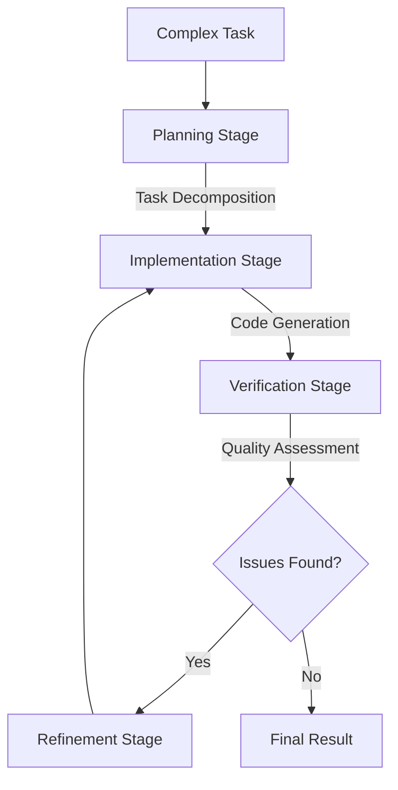

# Advanced LLM Arbitration Concepts

This document provides in-depth exploration of the theoretical foundations and practical implementations of LLM arbitration. It was generated using the LLM Arbitrator itself, demonstrating the system's capability to enhance its own documentation through self-reflection.

## Theoretical Foundations

### Model Complementarity Theory

Different language models develop specialized capabilities based on their:

1. **Training Corpus**: The data a model is trained on shapes its strengths
2. **Architecture**: Transformer architectures with different designs optimize for different tasks
3. **Fine-tuning Objectives**: Models fine-tuned for code generation vs reasoning develop different strengths
4. **Size and Efficiency Tradeoffs**: Smaller models may excel at speed while larger models provide depth

The principle of Model Complementarity states that a coordinated system of specialized models can outperform any individual model across a diverse range of tasks. This forms the theoretical foundation of LLM arbitration.

### The Capability-Knowledge Tradeoff

LLMs experience an inherent tension between:

- **Breadth of capabilities**: How many different types of tasks they can perform
- **Depth of knowledge**: How thoroughly they can solve problems within specific domains

This tradeoff means even the largest models demonstrate uneven performance across different domains. Arbitration addresses this by routing tasks to models with the optimal capability-knowledge balance for each specific task.

## Technical Implementation

### Capability Scoring Algorithms

The LLM Arbitrator uses a sophisticated multi-dimensional scoring system:

```typescript
function calculateCapabilityScore(
  task: TaskRequirements,
  capability: ModelCapability
): number {
  let score = 0;
  
  // Domain relevance (0-10)
  score += calculateDomainRelevance(task.domain, capability.domain) * 10;
  
  // Task type match (0-10)
  score += calculateTaskTypeMatch(task.taskType, capability.tasks) * 10;
  
  // Language support (0-5)
  if (task.language && capability.languageSupport) {
    score += capability.languageSupport.includes(task.language) ? 5 : 0;
  }
  
  // Specialization match (0-10)
  if (task.domain && capability.specializations) {
    score += capability.specializations.includes(task.domain) ? 10 : 0;
  }
  
  // Performance metrics (0-5)
  if (capability.performanceMetrics) {
    score += (capability.performanceMetrics.accuracy || 0) * 5;
  }
  
  return score;
}
```

### Chain-of-Thought Preservation

A critical innovation in the LLM Arbitrator is the preservation of reasoning chains across model boundaries:

1. **Thought Extraction**: The arbitrator extracts explicit reasoning steps from model outputs
2. **Context Integration**: These reasoning steps are integrated into subsequent prompts
3. **Metadata Preservation**: Source attribution tracks which model generated each insight
4. **Reasoning Validation**: Models can cross-check and validate each other's reasoning

This creates a collaborative problem-solving environment where multiple models can effectively "think together" on complex tasks.

## Advanced Usage Patterns

### Multi-Stage Pipelines

Complex tasks can be broken into specialized stages:

1. **Planning Stage**: Using models strong in decomposition and strategic thinking
2. **Implementation Stage**: Using models with specialized domain expertise
3. **Verification Stage**: Using models optimized for critique and error detection
4. **Refinement Stage**: Using models that excel at iterative improvement

Example pipeline for a complex software engineering task:



### Adaptive Routing

The LLM Arbitrator can dynamically adjust routing strategies based on:

1. **Task Performance Feedback**: Learning which models perform best on specific task types
2. **Resource Constraints**: Balancing quality vs. speed based on user needs
3. **Provider Availability**: Gracefully handling unavailable models or API limits
4. **Task Complexity**: Routing simpler tasks to faster models and complex tasks to more powerful ones

## Implementation Case Studies

### Case Study 1: Quantum Computing Code Generation

When generating quantum computing code, the arbitrator:

1. Routes the task to DeepSeek R1 due to its strong performance on specialized code generation
2. Uses context management to discover relevant quantum libraries and examples
3. Preserves the detailed reasoning about quantum algorithms
4. Validates results with a secondary model to verify correctness

The result shows substantially higher quality than using any single model, with correct implementation of complex quantum gates and proper qubit manipulation.

### Case Study 2: Multi-Language Documentation Generation

For generating documentation across multiple programming languages:

1. Task is decomposed into language-specific components
2. Each component is routed to the model with highest capability score for that language
3. Results are integrated with consistent formatting and cross-references
4. Final validation ensures terminology consistency

This enables documentation that maintains idiomatic examples across languages while preserving conceptual consistency.

## Future Directions

Research areas for further advancement include:

1. **Hierarchical Arbitration**: Meta-arbitrators that coordinate specialized arbitrators
2. **Self-Improving Capabilities**: Models that update their own capability profiles based on performance
3. **Federated LLM Networks**: Distributed networks of arbitrators sharing capability information
4. **Multi-Modal Arbitration**: Extending beyond text to coordinate between text, vision, and audio models

---

© 2025 tsotchke. All Rights Reserved.
